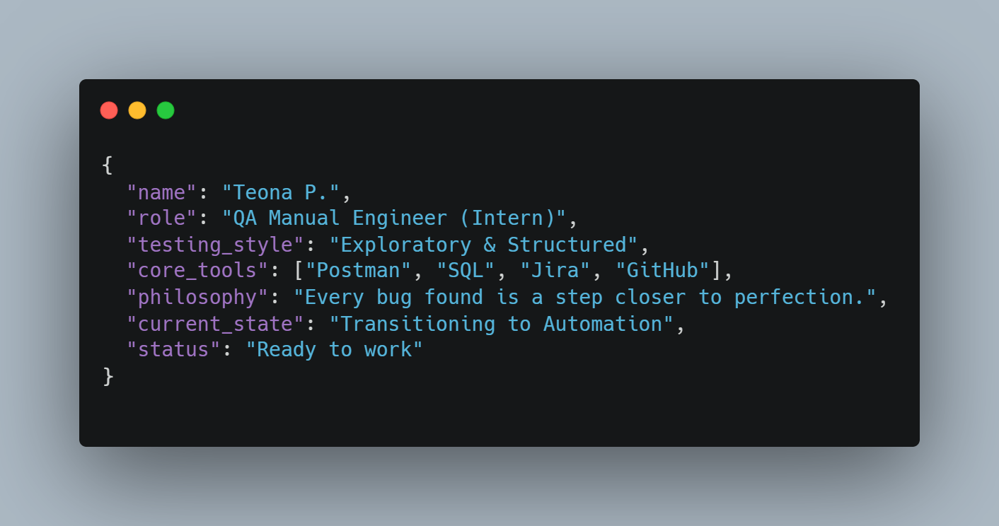
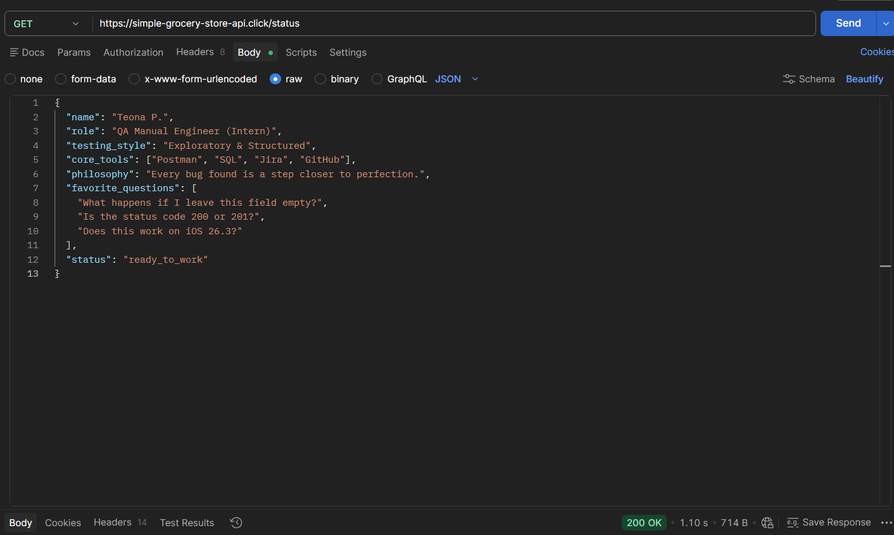

# 👩‍💻 QA Engineer Portfolio | Teona Pkhaladze

  

  
  &nbsp;&nbsp;
  

---

### 🛠 Tech Stack & Skills
| Category | Tools & Technologies |
| :--- | :--- |
| **Testing Management** | Jira, Trello, Asana, ClickUp, TestCaseLab, TestRail |
| **API Testing** | Postman, Swagger |
| **Databases & Web** | SQL, HTML/CSS, DevTools |
| **Performance & UI** | JMeter, Figma |
| **Automation** | Java (In Progress), Playwright |

---

### 🚀 Projects & Highlights

#### 🤖 Test Automation (Java Logic)
*Demonstrating boundary value analysis and conditional logic for automated workflows.*

  

<i>Detailed script: <a href="./automation-scripts.md">View Code</a></i>

#### 📡 API Testing & Documentation
*Structured API validation and collection management.*

  

<i>Collections: <a href="./api-testing.md">View Documentation</a></i>

---

### 📂 Repository Structure
* 📋 [**Test Case Checklists**](./checklists.md) — *Structured functional verification.*
* 🐛 [**Bug Reports**](./bug-reports.md) — *Detailed defect documentation and lifecycle management.*
* 🗄️ [**SQL Queries**](./sql-queries.md) — *Database integrity and verification scripts.*

---

### 💼 Professional Experience
* **QA Intern | Binary Forge** (03/2026 - Present)
  * [cite_start]Mobile application testing (Android & iOS) on real-world projects[cite: 42].
  * [cite_start]Executing functional and UI/UX validation[cite: 44, 45].
* **QA Intern | ODIN** (02/2026 - 03/2026)
  * [cite_start]Conducted User Acceptance Testing (UAT) and identified critical bugs[cite: 54, 57].

  <i>"Observation is my API. Every bug found is a step closer to perfection."</i>

