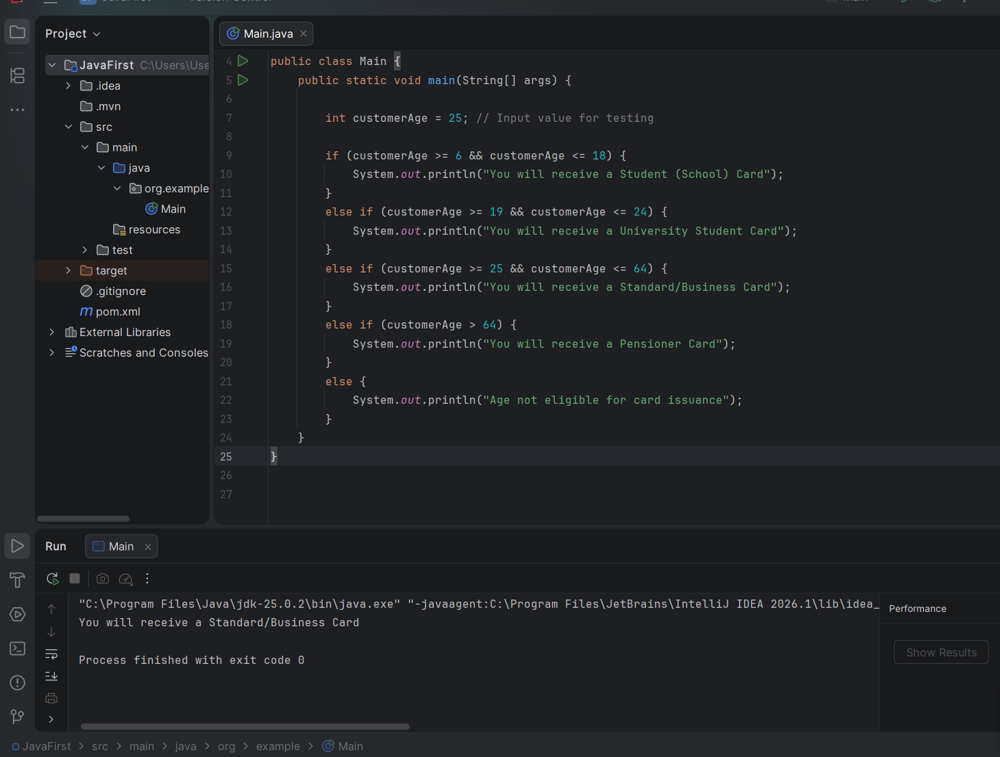

# 🤖 Java Automation Fundamentals

This section demonstrates my understanding of Java programming logic and its application in software testing scenarios.

---

## ☕ Conditional Logic: Age-Based Card Issuance
I implemented a script that validates business rules for a card issuance system using `if / else if` structures.

### 🖼️ Execution Proof (IntelliJ IDEA)
Below is a screenshot of the code running successfully, showing the logic correctly categorizing a 25-year-old user.

<p align="center">
  
</p>

### 💻 Java Code Implementation
```java
public class Main {
    public static void main(String[] args) {

        int customerAge = 25; // Input value for testing

        if (customerAge >= 6 && customerAge <= 18) {
            System.out.println("You will receive a Student (School) Card");
        } 
        else if (customerAge >= 19 && customerAge <= 24) {
            System.out.println("You will receive a University Student Card");
        } 
        else if (customerAge >= 25 && customerAge <= 64) {
            System.out.println("You will receive a Standard/Business Card");
        } 
        else if (customerAge > 64) {
            System.out.println("You will receive a Pensioner Card");
        }
        else {
            System.out.println("Age not eligible for card issuance");
        }
    }
}

---

## 📑 QA Test Scenarios & Methodology
To verify the logic above, I applied **Equivalence Partitioning** and **Boundary Value Analysis (BVA)**. This ensures that the application handles transitions between different age categories correctly.

| Test Case | Input (Age) | Expected Output | Testing Technique |
| :--- | :--- | :--- | :--- |
| **TC-01** | 18 | You will receive a Student (School) Card | Boundary Value (Upper) |
| **TC-02** | 19 | You will receive a University Student Card | Boundary Value (Lower) |
| **TC-03** | 25 | You will receive a Standard/Business Card | Positive Testing |
| **TC-04** | 5 | Age not eligible for card issuance | Negative Testing |

---
